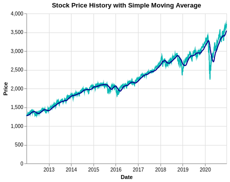

# stock_analyzer

 [](https://codecov.io/gh/UBC-MDS/stock_analyzer)  [](https://stock_analyzer.readthedocs.io/en/latest/?badge=latest)

This is a Python package that provides basic time series modelling functionalities to analyze historical stock prices. Investment in the stock market requires not only knowledge about the listed companies, but also basic summary statistics and modellings of individual stock prices. Given time-series stock price data, this package provides key summary statistics, applies moving average and exponential smoothing models to the data, and visualizes in-sample moving average as well as exponential smoothing fits. A convenient use case for this package is to combine it with the `pandas_datareader` package, which can provide well-formated stock price data from Yahoo Finance dataset with customized date range setting.

## Installation

```bash
$ pip install -i https://test.pypi.org/simple/ stock_analyzer
```

## Features

The package contains the following five functions:

- `summaryStats`

This function calculates summary statistics including mean price, minimum price, maximum price, volatility and return rate based on daily historical stock prices.
Users can specify lengths of time spans to calculate summary statistics on, and what kind of stock price measurement to use.

- `movingAverage`

This function applies the moving average model to all measurements of stock price and returns a pandas dataframe containing in-sample fitted values. Users can specify the length of moving average windows (unit: days).

- `exponentialSmoothing`

This function performs exponential smoothing on historical stock price time series data. Users can specify the `alpha` parameter (which defines the weighting, ranging between 0 and 1) for smoothing.

- `visMovingAverage`

This function creates a line chart showing the raw historical data and fitted data using the moving average method. Users are able to specify the dataframe used, the column of choice (such as 'Close', 'Adj Close') for moving average calculation, and the length of moving average window (unit: days).

- `visExpSmoothing`

This function creates a line chart showing the raw historical data and fitted data using the exponential smoothing method. Users are able to specify the dataframe used, the column of choice (such as 'Close', 'Adj Close') for exponential smoothing calculation, and the `alpha` parameter (which defines the weighting, ranging between 0 and 1) for smoothing.

## Python Ecosystem

In the Python ecosystem, there are multiple packages with functionalities of time series modelling and analyses. In particular, `pandas` and `statsmodels` packages both provide functionalities to calculate summary statistics for time series data and basic time series modelling. In terms of time series visualization, packages including `matplotlib`, `seaborn` and `altair` all have good functionalities. However, users would need to use them separately to conduct the functionalities that this package does.

There are also multiple python packages dedicated to financial analyses. Examples include [`QuantPy`](https://github.com/jsmidt/QuantPy), [`ffn`](https://github.com/pmorissette/ffn) and [`PyNance`](http://pynance.net/). There packages have similar funcitonalities to this pakcage.

## Dependencies

- pytest = \^6.2.2
- pytest-cov = \^2.11.1
- codecov = \^2.1.11
- python-semantic-release = \^7.15.0
- flake8 = \^3.8.4
- Sphinx = \^3.5.1
- sphinxcontrib-napoleon = \^0.7
- matplotlib = \^3.3.4
- pandas-datareader = \^0.9.0
- pandas = \^1.2.3
- altair = \^4.1.0
- numpy = \^1.20.1

## Usage

`from stock_analyzer import stock_analyzer` 
```Python
import pandas_datareader as web
import numpy as np
import pandas as pd
import altair as alt
import warnings
```

```Python
df = web.DataReader('^GSPC', data_source='yahoo', start='2012-01-01', end='2020-12-17')
stock_analyzer.summaryStats(data = df, measurements=["Open", "Volume"])
```

```
 start_date	 end_date	    mean	    min	        max	    volatility	 return
    0	2020-12-07	2020-12-17	3683.394423	3656.080078	3713.649902	20.641892	0.005121
    1	2020-11-17	2020-12-17	3646.368641	3559.409912	3713.649902	44.058352	0.028624
    2	2020-11-17	2020-12-17	3646.368641	3559.409912	3713.649902	44.058352	0.028624
```

```Python
stock_analyzer.movingAverage(df,100,['movingAverage'+ name for name in df.columns])
```

```
            movingAverageHigh  movingAverageLow  movingAverageOpen  movingAverageClose  movingAverageVolume  movingAverageAdj Close
    Date
    2012-01-03        1284.619995       1258.859985        1258.859985         1277.060059         3.943710e+09             1277.060059
    2012-01-04        1284.561095       1258.952385        1259.041686         1277.062458         3.940199e+09             1277.062458
    2012-01-05        1284.545396       1259.016385        1259.226086         1277.102458         3.943921e+09             1277.102458
    2012-01-06        1284.517595       1259.161185        1259.446787         1277.109958         3.941052e+09             1277.109958
    2012-01-09        1284.491295       1259.318086        1259.636487         1277.146357         3.935331e+09             1277.146357
    ...                       ...               ...                ...                 ...                  ...                     ...
    2020-12-11        3459.242998       3416.176194        3438.266194         3438.738198         4.415716e+09             3438.738198
    2020-12-14        3463.419199       3420.407996        3442.302495         3442.856499         4.418761e+09             3442.856499
    2020-12-15        3468.099500       3425.003696        3446.780793         3447.646401         4.423414e+09             3447.646401
    2020-12-16        3472.797900       3429.746897        3451.544893         3452.264001         4.424345e+09             3452.264001
    2020-12-17        3477.611902       3434.693899        3456.338691         3457.304402         4.425915e+09 
```
```Python
stock_analyzer.exponentialSmoothing(df,['exponentialSmoothing'+ name for name in df.columns])
```

```
                             exponentialSmoothingHigh exponentialSmoothingLow	exponentialSmoothingOpen	exponentialSmoothingClose	exponentialSmoothingVolume	exponentialSmoothingAdj Close
    Date						
    2012-01-03	                      1284.619995	         1258.859985	                1258.859985	                 1277.060059	         3.943710e+09	                1277.060059
    2012-01-04	                      1282.852991	         1261.631982	                1264.310999	                 1277.132056	         3.838371e+09	                1277.132056
    2012-01-05	                      1282.912108	         1262.720391	                1268.207714	                 1278.310457	         3.981645e+09	                1278.310457
    2012-01-06	                      1282.590465	         1265.906263	                1272.024416	                 1278.160337	         3.884200e+09	                1278.160337
    2012-01-09	                      1282.410323	         1268.499399	                1273.766078	                 1278.922221	         3.730420e+09	                1278.922221
    ...	                                      ...	                 ...	                        ...	                         ...	                  ...	                        ...
    2020-12-11	                      3683.080578	         3649.520587	                3668.977441	                 3671.981068	         4.714086e+09	                3671.981068
    2020-12-14	                      3687.439437	         3648.416438	                3670.865215	                 3664.633745	         4.678337e+09	                3664.633745
    2020-12-15	                      3689.794617	         3651.777541	                3669.528624	                 3673.629656	         4.582920e+09	                3673.629656
    2020-12-16	                      3696.237238	         3662.815300	                3677.545037	                 3681.891736	         4.425129e+09	                3681.891736
    2020-12-17	                      3704.902102	         3677.231745	                3688.376496	                 3694.068209

```


```Python
stock_analyzer.visMovingAverage(df,'Close', 50)
```


```Python
stock_analyzer.visExpSmoothing(df,'Close', 0.3)
```


## Documentation

The official documentation is hosted on Read the Docs: https://stock_analyzer.readthedocs.io/en/latest/

## Contributors

We welcome and recognize all contributions. You can see a list of current contributors in the [contributors tab](https://github.com/UBC-MDS/stock_analyzer/graphs/contributors).

- Kangyu (Mark) Wang 
- Sicheng (Marc) Sun
- William Xu 
- Tingyu Zhang

### Credits

This package was created with Cookiecutter and the UBC-MDS/cookiecutter-ubc-mds project template, modified from the [pyOpenSci/cookiecutter-pyopensci](https://github.com/pyOpenSci/cookiecutter-pyopensci) project template and the [audreyr/cookiecutter-pypackage](https://github.com/audreyr/cookiecutter-pypackage).
